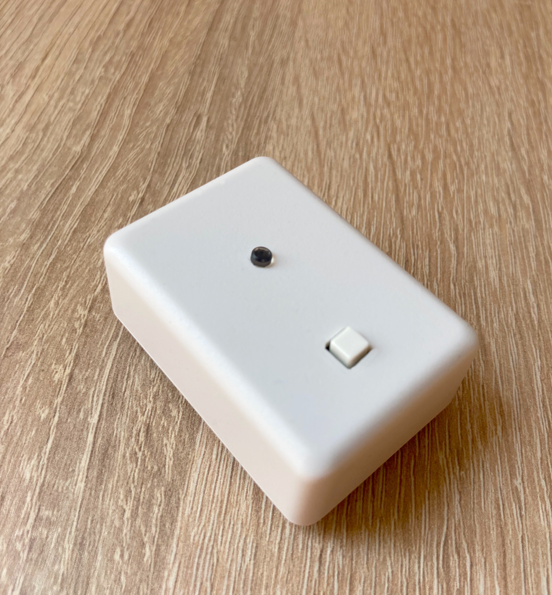
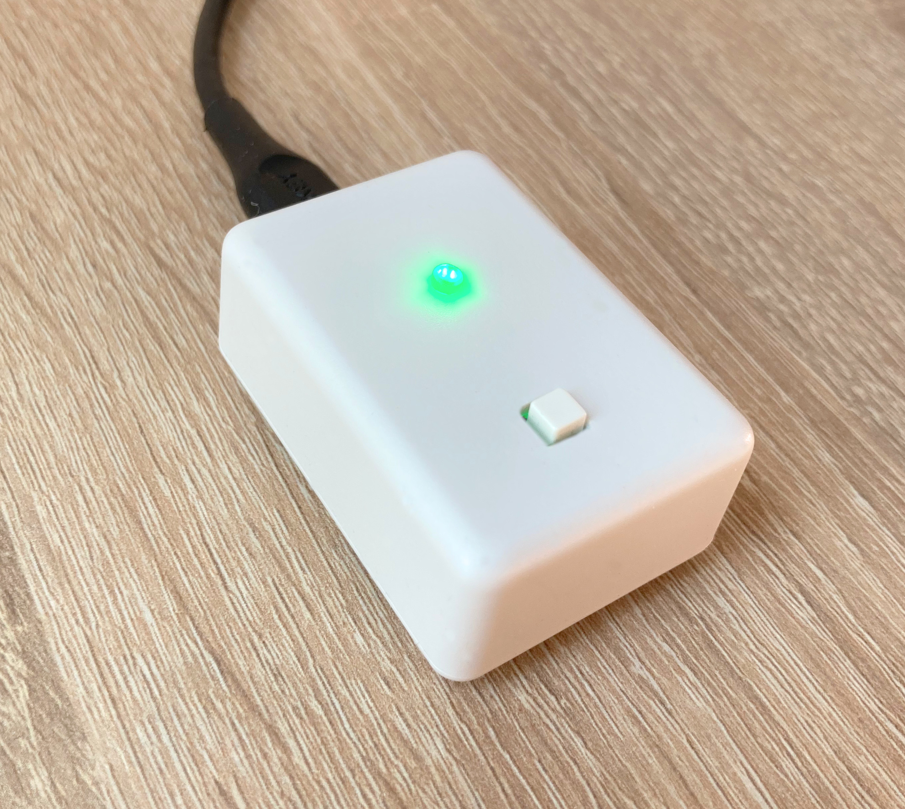

# Aion2
Simple device that reminds you to take short breaks while working in front of a computer. 

### Features
* USB-C power
* LED and vibration motor are used to communicate with the user
* Only one button required for full user interaction

### Usage

The device is powered through a USB-C cable, which can be plugged into the PC or any other USB charger. To start the timer, click the button on the casing. LED should flash two times and the device will vibrate. After that, a countdown will start, when enough time has passed, the device will begin to flash its LED and periodically vibrate to signal you need to take a break. Once you're ready for a break, click the button. The device will give you an indication when you can get back to work and automatically start the timer again. To shut down the device, simply hold the button for at least two seconds and let go.

### Modes of operation
The device can enter three distinct modes of operation, which can be selected by holding the button for a certain time during startup.
* < 1s - Normal mode
* \> 1s and < 2s - Quiet mode - vibration motor is disabled
* \> 2s - Aggressive mode - work period is slightly reduced, breaks are longer. Vibration is stronger. 

### Images

